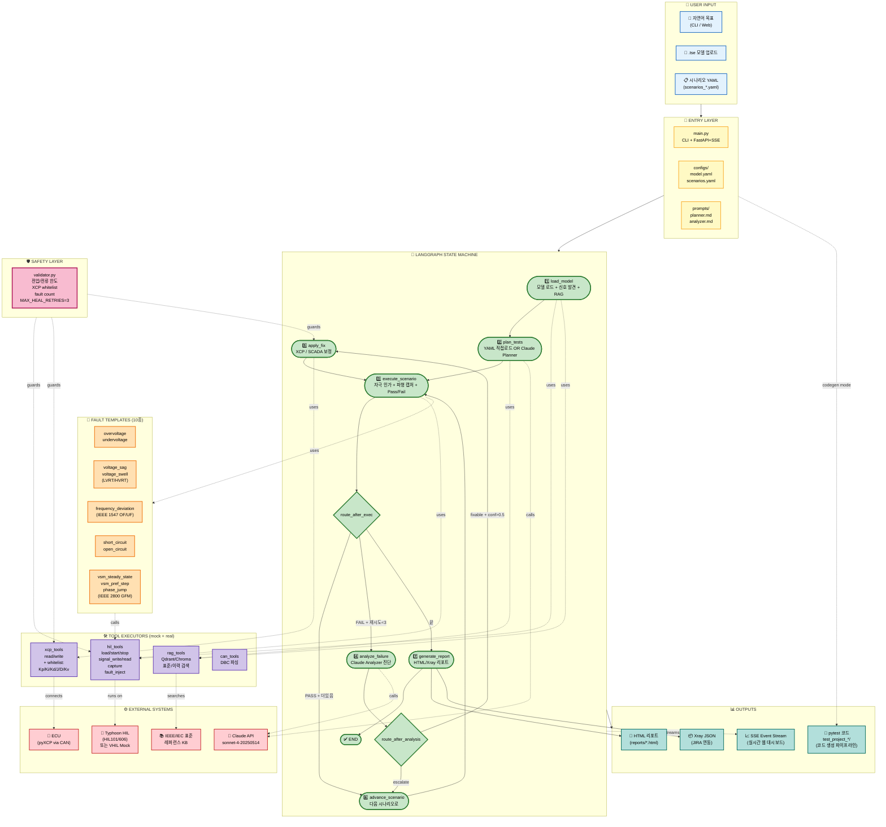

# THAA — Typhoon HIL AI Agent: 전체 동작 흐름



## 한눈에 보는 흐름

```
USER (자연어 + .tse + YAML)
  └─▶ main.py (CLI/Web)
        └─▶ LangGraph (7 nodes + 3 conditional edges)
              ├─ load_model    → HIL 연결, 신호 발견, RAG 컨텍스트
              ├─ plan_tests    → YAML 직접 OR Claude로 시나리오 생성
              ├─ execute_scenario ┐
              │     ↑            │ 자극 인가 (10 fault templates)
              │     │            ↓ 캡처 + Pass/Fail
              │     │  [route_after_exec]
              │     │     ├─ PASS → advance_scenario → 반복
              │     │     ├─ FAIL → analyze_failure (Claude) → apply_fix → 재실행 (max 3회)
              │     │     └─ DONE → generate_report
              │     └────────────┘
              └─▶ HTML 리포트 + SSE 이벤트 스트림 + (옵션) pytest 코드 생성
```

## 핵심 능력 요약

| 영역 | 구현 |
|------|------|
| **모델 지원** | Typhoon HIL (.tse) — BMS 12S, ESS/EV 충전기, VSM 인버터 검증됨 |
| **표준 커버리지** | IEEE 1547 (전압/주파수/VRT/THD/반도운전), IEEE 2800 (GFM 6영역), IEC 62619, UL 9540, IEC 61851 |
| **자가 치유** | Claude Analyzer 진단 → XCP/SCADA 보정 (J/D/Kv/Kp/Ki/Kd) → 재실행 |
| **안전** | XCP write 화이트리스트, 전압/전류 한도, 결함 주입 카운트, MAX_HEAL_RETRIES=3 |
| **모드** | Real HIL hardware / Virtual HIL / Mock (모두 동일 코드) |
| **출력** | HTML + Xray JSON 리포트 + 실시간 SSE + 자동 pytest 코드 생성 |
| **테스트** | 부모 111개 + GFM 서브프로젝트 28개 = **139개 자동화 테스트** |
